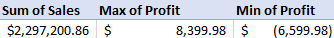
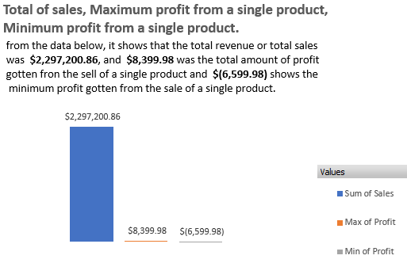
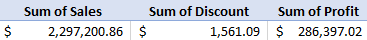
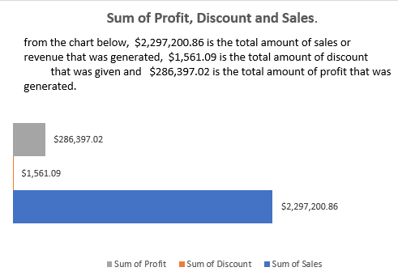
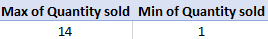
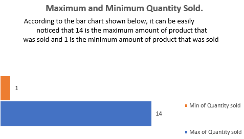
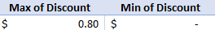
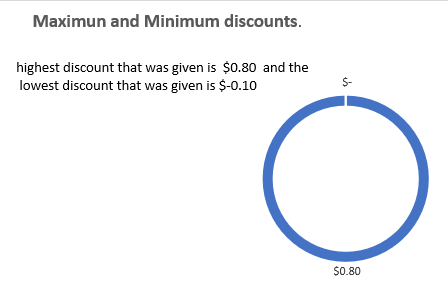
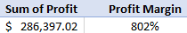
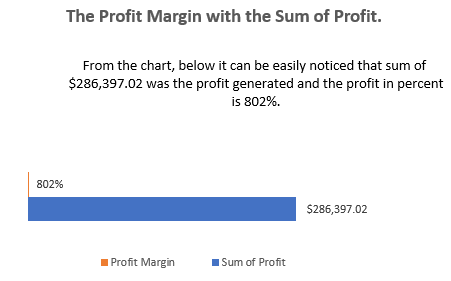

### Comprehensive-Analysis-for-C-C-super-store.

                        

### INSIGHTS

### Total of sale, maximum profit from a single product and minimum profit from a single product.

1.	$2,297,200.86 is the total amount of sales or revenue that was generated.
2.	$8,399.98 is the maximum profit gotten from the sale of a single product.
3.	$-(6,599.98) is the minimum profit gotten from the sale of a single product.

                        

### INSIGHTS
### Sum of profit, discount sales:
1.	$2,297,200.86 is the total amount of sales or revenue that was generated.
2.	$1,561.09 is the total amount of discount that was given.
3.	$286,397.02 is the total amount of profit that was generated.

### RECOMMENDATION:
1.	More values can be added to the generated profit only if the market can be seriously studied and know exactly what the consumers wants and bring more of that to the market.
2.	More of discount should be given with caution, because it is among what attracts consumers. Caution in the sense that it should not affect the company’s profit.

                         

### INSIGHTS
### Maximum and minimum quantity sold
1.	14 is the maximum amount of product that was sold and most of the goods falls under office supply and furniture.
2.	1 is the minimum amount of product that was sold and it falls under the sub-categories of chairs, art, binders, appliances, accessories and phones.

                        

### INSIGHTS
### Maximum and minimum discount
1.	$0.80 is the maximum discount that was given.
2.	$0.10 is the minimum discount that was given.

### RECOMMENDATION
1.	Discount is a nice marketing strategy because its among what draws customers attention and it equally improves sales and boost their purchasing power.

                       

### INSIGHTS
### Profit margins with the sum of profit:
1.	$286,397.02 is the total amount of profit that was generated.
2.	802% is the profit margin.

### 6 BUSINESS QUESTIONS.
-----

1.	Which of the segment is most profitable?

**ANSWER:** the most profitable segment is the consumer segment.

2.	Which of the categories sells most?
   
**ANSWER:** Office supply category sells most.

3.	Which of the state generated the most sales?
   
**ANSWER:** New York City generated the most sales

4.	Which of the customers has the highest purchasing power?
   
**ANSWER:** William Brown, 37 times

5.	What were at our total expenses?
    
 **ANSWER:** $1,561.09 is our total expenses.

6.	Which order date has the maximum number of transactions?
    
**ANSWER:** 9/5/2016 is the date with 38 number of transactions.

### THE 4 KEY PERFORMANCE INDICATORS
------

1. TOTAL REVENUE-----------                         **$2,297,200.86** 
2. PROFIT MARGIN-----------                         **802%** 
3. TOTAL NUMBER OF SALES RECORDED------------       **9994**
4. HIGHEST PROFIT GENERATED-----------------        **$8,399.98**

### INFORMATIONS GATHERED FROM DATA WITH THEIR CORRESPONDING FORMULA
-----

1. highest profit generated-------------------**MAX**
2. lowest profit generated--------------------**MIN**
3. Total Sales--------------------------------**SUM**                    
4. Total Discount-----------------------------**SUM**
5. Number Of Unit Sold------------------------**COUNT**
6. Average price per unit---------------------**TOTAL SALES/ NUMBER OF UNITS SOLD**
7. Profit Margin------------------------------**TOTAL SALES/ TOTAL PROFIT**
8. Highest profit generated-------------------**MAX**
9. Maximum discount given---------------------**MAX**
10. minimum discount given--------------------**MIN**
11. highest quantity sold---------------------**MAX**
12. minimum quantity sold---------------------**MIN**
13. Total profit------------------------------**SUM**
